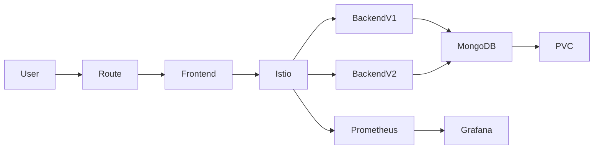

# Production Microservices Project

# 🚀 OpenShift Microservices Platform

## 📌 Overview

This project demonstrates a **production-grade cloud-native microservices architecture** deployed on OpenShift and Kubernetes.

It showcases end-to-end DevOps practices including containerization, CI/CD automation, service mesh traffic management, persistent storage, and secure API access.

---

## 🏗️ Architecture



---

## 🧩 System Components

### 🔹 Frontend

* Lightweight UI served via NGINX
* Communicates with backend APIs
* Exposed through OpenShift Route

### 🔹 Backend (Node.js)

* REST API service
* JWT-based authentication
* Scalable deployment (multiple replicas)

### 🔹 Database (MongoDB)

* Persistent storage using Kubernetes PVC
* Ensures data durability across pod restarts

### 🔹 Service Mesh (Istio)

* Traffic splitting (A/B deployments)
* Observability and routing control
* Enables progressive delivery strategies

### 🔹 CI/CD Pipeline

* Automated build and deployment via GitHub Actions
* Container image build & push
* Deployment to OpenShift cluster

### 🔹 Monitoring Stack

* Prometheus for metrics collection
* Grafana for visualization dashboards

---

## ⚙️ Technology Stack

* OpenShift / Kubernetes
* Docker (Containerization)
* Node.js (Backend)
* NGINX (Frontend)
* MongoDB (Database)
* Istio (Service Mesh)
* GitHub Actions (CI/CD)
* Prometheus & Grafana (Monitoring)
* Helm (Packaging & deployment)

---

## 🚀 Deployment Guide

### 1. Clone Repository

```bash
git clone https://github.com/YOUR_USERNAME/openshift-microservices-platform.git
cd openshift-microservices-platform
```

---

### 2. Configure Images

Update container image references:

```bash
your-dockerhub/backend:latest
your-dockerhub/frontend:latest
```

---

### 3. Deploy to OpenShift

```bash
oc new-project microservices-demo
oc apply -f k8s/
```

---

### 4. Enable Service Mesh (Optional)

```bash
oc apply -f istio/
```

---

### 5. Access Application

```bash
oc get route
```

---

## 🔄 CI/CD Workflow

* Code pushed to `main` branch
* GitHub Actions pipeline triggers:

  * Build Docker images
  * Push to container registry
  * Deploy to OpenShift via CLI

---

## 📊 Observability

* Metrics collected via Prometheus
* Dashboards visualized in Grafana
* Enables performance monitoring and alerting

---

## 🔐 Security

* JWT-based authentication for API endpoints
* Token validation for protected routes
* Ready for integration with OAuth providers

---

## 📈 Key Features

* Scalable microservices architecture
* A/B deployment using service mesh
* Persistent data storage
* Automated CI/CD pipeline
* Production-ready monitoring stack
* Secure API access

---

## 🎯 Learning Outcomes

This project demonstrates:

* Real-world Kubernetes and OpenShift usage
* Microservices deployment patterns
* DevOps automation practices
* Cloud-native architecture design
* Observability and system monitoring

---

## 📌 Future Enhancements

* GitOps with ArgoCD
* HTTPS/TLS configuration
* Role-based access control (RBAC)
* Horizontal Pod Autoscaling (HPA)
* Multi-environment deployments (dev/staging/prod)

---

## 👨‍💻 Author

FAWAD UL HAQ
Cloud / DevOps Engineer

---

## ⭐ Contributing

Feel free to fork this repository and contribute enhancements or improvements.

---
